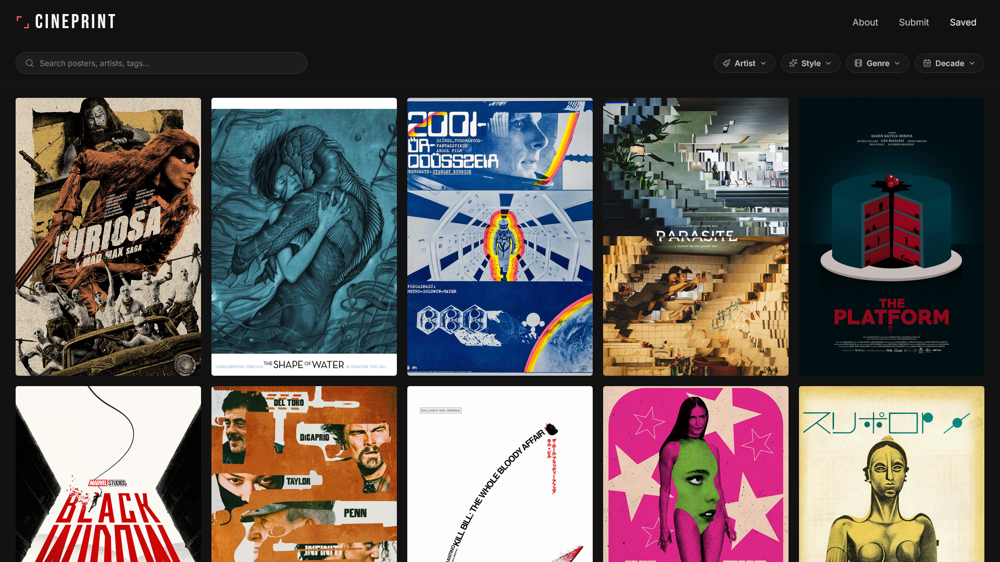
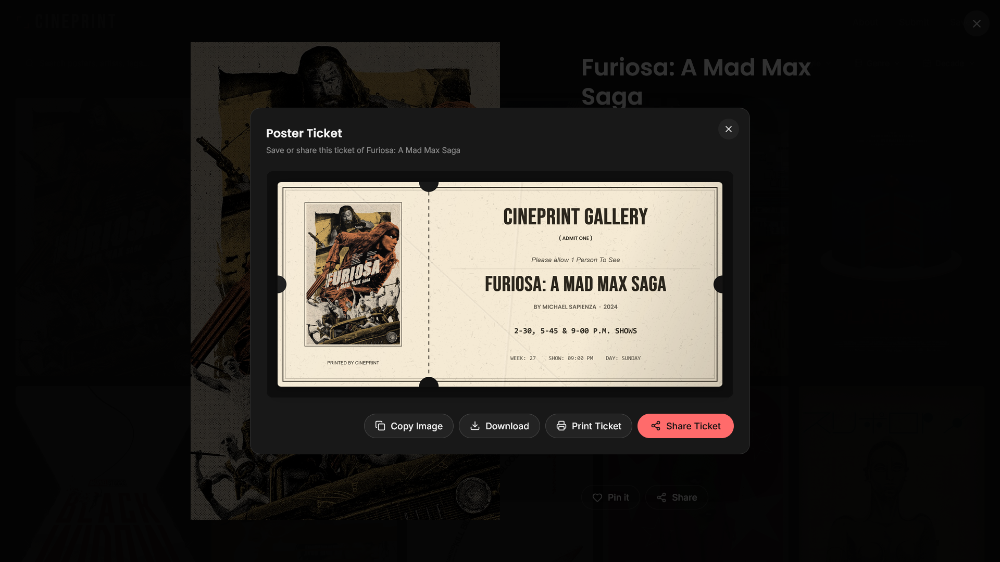
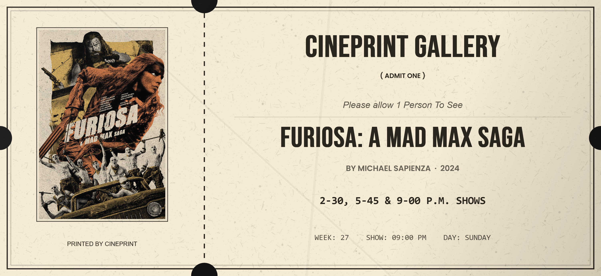

# CinePrint 🎬

CinePrint is a premium digital gallery celebrating custom alternative movie posters, minimalist film art, and television key designs created by talented independent designers and illustrators globally. It features a fully-dynamic search and filtering system, server-side integration with Notion, and a custom canvas-based vintage ticket generator.

---

## 📸 Screenshots

### 🖼️ Curated Archive & Filters

Explore posters filtered dynamically by title, artist, style, decade, and genre.



### 🎫 Retro Ticket Generator

Generate, copy, download, or share high-resolution vintage ticket prints of alternative posters.



### 📽️ Interactive Lightbox

View detailed credits, co-creator profiles, and movie specifications in a cinematic lightbox.



---

## ✨ Features

- **Premium Context Menu**: Right-click on desktop or long-press (500ms hold) on mobile to summon a glassmorphic context menu to Pin/Unpin posters and Open high-res images in a new tab. Fully optimized with screen bounds collision detection and outside interaction auto-close.
- **Cinematic Lightbox Navigation**: Fast keyboard navigation using Left/Right arrow keys with smooth, cross-faded card transitions. Features hover-activated navigation button overlays and subtle `<kbd>` guide indicators.
- **Random Poster ("Feeling Lucky")**: A Sparkles icon button in the header nav bar that opens a completely random poster. Respects current active/filtered list arrays to maintain navigation index continuity.
- **Dynamic Poster Counter**: Monospace indicator showing matching results count above the grid. Updates in real-time as search queries and dropdown filters are modified.
- **Interactive 3D Ticket Tilt & Glare**: Visual ticket stub previews respond dynamically:
  - Desktop: Tilts in response to mouse cursor hover positions.
  - Mobile: Rotates utilizing the device's orientation gyroscope (with relative calibration offsets).
  - Shifting radial light glare overlays mimic real-world metallic reflections.
- **Dynamic Artist Showcase Pages**: Dynamic `/artist/$slug` portfolio views for every creator. Allows users to view all works by a specific artist. Includes a custom layout with dynamic poster counters, back-to-gallery navigation, direct external portfolio links, and cinematic lightbox integration. Easily shareable for organic traffic.
- **Multi-Dimensional Filtering**: Search and filter by Style, Genre, Decade, and Artist.
- **Vintage Ticket Generator**: Render high-resolution (3000x1380) tickets on the fly using a canvas compiler:
  - Dynamic dates, show schedules, and seat numbering.
  - High-fidelity barcode overlays.
  - Organic paper texture generator combining noise grain, fiber strands, and 3D crumple shading.
- **Comprehensive Share Options**: Download PNG stubs, print directly, copy to clipboard, or share using the Web Share API.
- **Notion Integration**: Uses Notion as a CMS, retrieving posters dynamically and allowing community submissions directly to the database.
- **Two-Role Submission Flow**: Form toggles specifically for Fans and Original Artists, with built-in copyright confirmation.
- **SEO Optimized Pages**: Complete route metadata headers, descriptive headers, and search-engine index friendly visible copy.
- **Fully Responsive & Clean**: Tailwind-powered interface optimized for mobile and desktop viewports.

---

## 🛠️ Tech Stack

- **Framework**: [React](https://react.dev/) + [Vite](https://vitejs.dev/) + [TypeScript](https://www.typescriptlang.org/)
- **Routing**: [TanStack Router](https://tanstack.com/router)
- **Styling**: [Tailwind CSS](https://tailwindcss.com/)
- **Icons**: [Lucide React](https://lucide.dev/)
- **CMS / Database**: [Notion API](https://developers.notion.com/)

---

## 🚀 Getting Started

### 1. Prerequisites

Ensure you have Node.js and npm (or Bun) installed.

### 2. Environment Setup

Create a `.env` file in the root directory:

```env
NOTION_API_KEY=your_notion_integration_token
NOTION_DATABASE_ID=your_notion_database_id
```

### 3. Installation

Install project dependencies:

```bash
npm install
# or
bun install
```

### 4. Running the Development Server

Start the local server:

```bash
npm run dev
# or
bun run dev
```

The application will be running at `http://localhost:5173`.

### 5. Build for Production

Compile and bundle the project:

```bash
npm run build
```

---

## 📂 Project Structure

```text
├── src/
│   ├── components/      # UI components (FilterBar, Lightbox, ShareModal, Header, Footer)
│   ├── hooks/           # Custom React hooks
│   ├── lib/             # Notion integration, Ticket canvas drawing, Types
│   ├── routes/          # TanStack routing pages (Home, About, Submit)
│   ├── styles.css       # Core styles and custom CSS utilities
│   ├── router.tsx       # Routing configuration
│   └── main.tsx         # Entry point
```

---

_CinePrint is curated and maintained by [Prathamesh](https://github.com/Prathamesh913)._
